# Coursera_Capstone
Final course of IBM Data Science Professional Certificate by Coursera.

Requisites:
1- Introduction | 2- Data | 3- Methodology | 4 - Results | 5 - Discussion | 6- Conclusion
# 1 - Introduction 
Many world metropolises have overpopulation and high purchasing power in common. This mixture of ingredients often leads to high crime rates.
Since tourists do not have an in-depth knowledge of common crime points, this project was inspired by the protection of these tourists.

## Real world case

In general, every traveler, whether for business or pleasure, intends to enjoy a little of the place and have fun.
Inspired by a scenario in which some co-workers will go to Chicago on business, they will have a few more days to explore the city. Knowing them, I know they like to go out at night after work and drink some drikes and listen to good music.

This project's main idea is to predict the potential for a crime to happen close to a nightclub search on foursquare.

Let's go!

# 2 - Data
In this session I will quickly explain the origin and method of data acquisition.

## Crimes occurred in Chicago in 2019 
The data were accessed at: https://data.cityofchicago.org/Public-Safety/Crimes-2019/w98m-zvie, where the API was generated to download in https://data.cityofchicago.org/api/views/w98m-zvie/rows.csv?accessType=DOWNLOAD&api_foundry=true.

After some procedures for cleaning the data and creating new columns (which can be seen in detail in the attached notebook, remember, we are in the "Readme"), a new dataframe was created for the crimes that occurred in 2019.

## Descriptive statistics of Chicago crimes
## Graphs

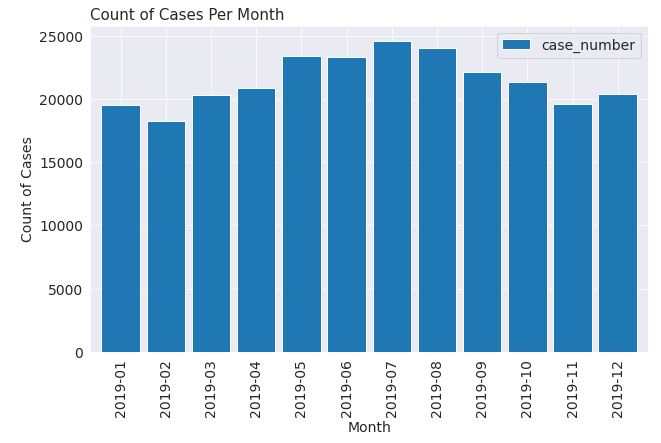
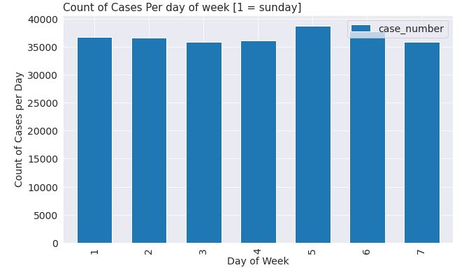
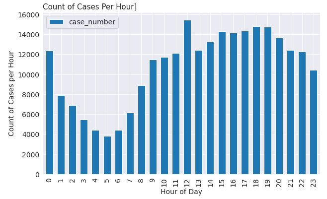
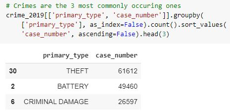
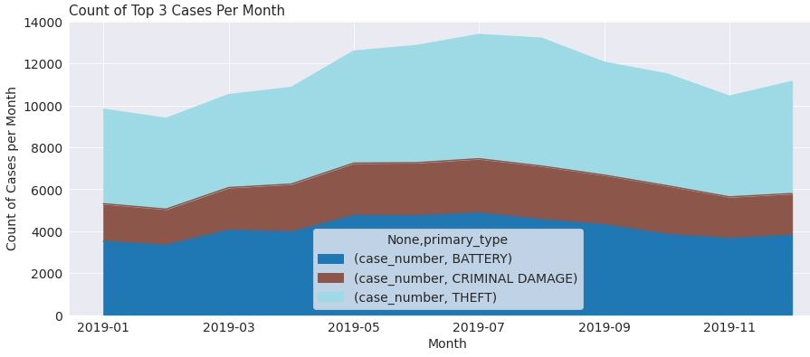
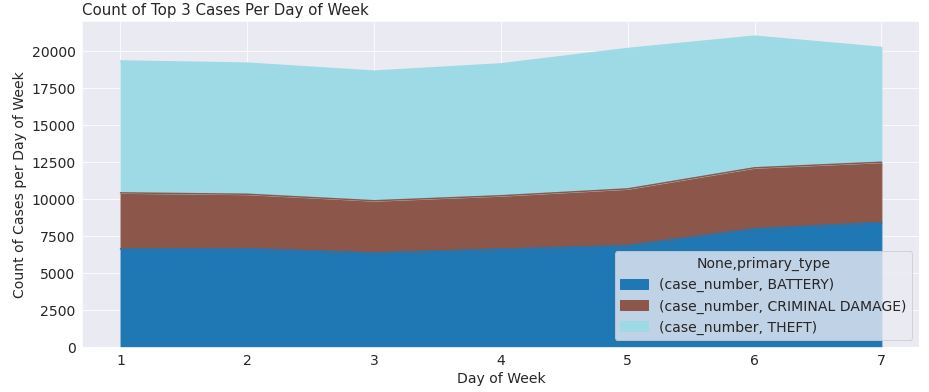

## Maps 
### Distribution of the 3 most common types of crimes in Chicago in july or reasons of ease of processing data.
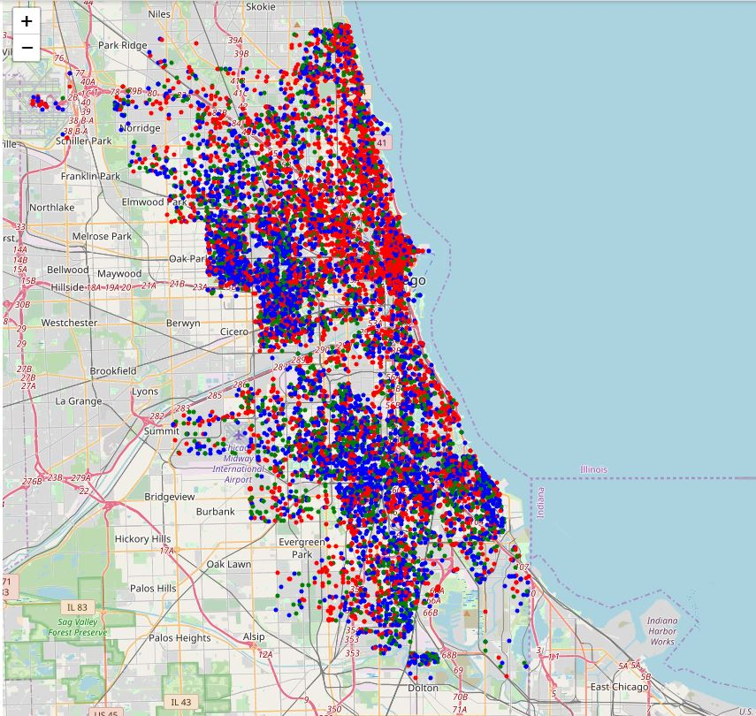

### The same data in cluster view
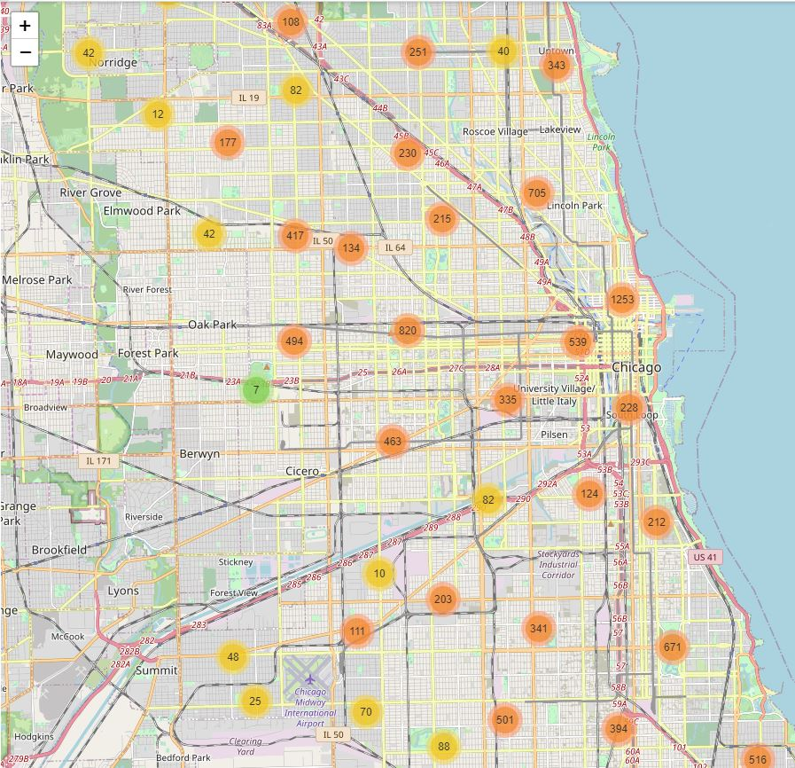

### Heat map
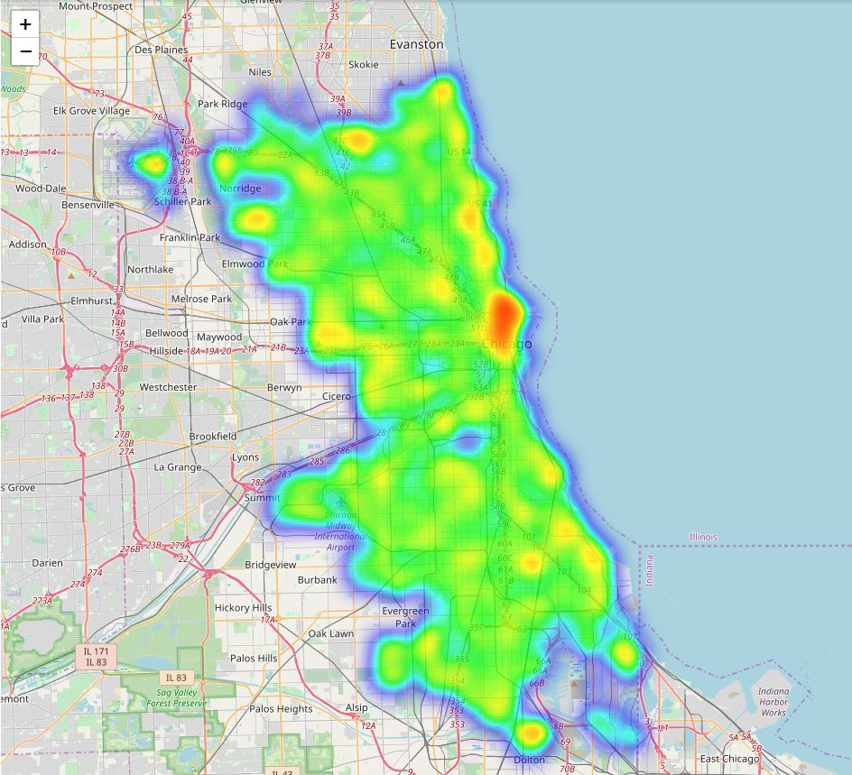

## Nightclubs
With a focus on a particular region where there are many blogs talking about nightlife, the data was taken by the link below, where it was focused on a particular region and nightlife.
https://foursquare.com/explore?mode=url&ne=41.893525%2C-87.622678&q=Nightlife&sw=41.886624%2C-87.635788.
The data was retrieved by a foursquare API where my credentials were introduced and the link above, where it was converted to HTML where I took the most important "classes".
You can see more details in the attached notebook.

## Maps 

### Initially the top 3 nightclubs were selected based on the likes received on foursquare, however, later those 3 were insufficient, with that, I used the top 30 nightclubs.

On the map you can see the 3 initials in red and the rest in black.
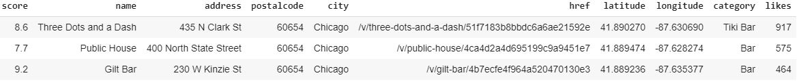

### Heat map of crimes and nightclubs

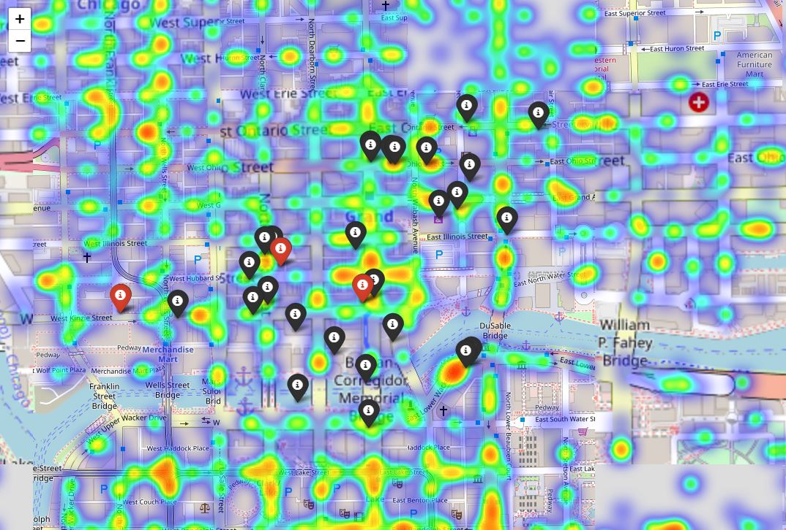

# 3 - Methodology

## Modeling

### Transform dataframa in only numerical and remove descriptive columns
See more details on the notebook

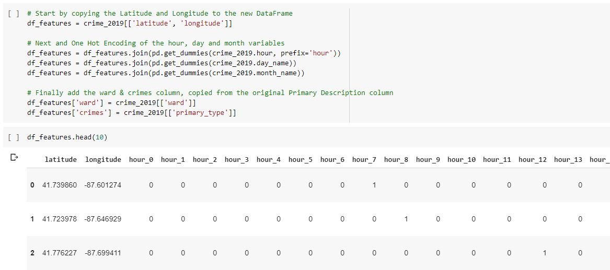

## Models
**Modelling task was turned into a simple binary classification task by only modelling based on the top two most occuring crimes. For each model development 10 Fold Cross Validation was used to ensure the best results were achieved and a Grid Search approach was used to determine the best setting for each of the models** 

### Cross validation

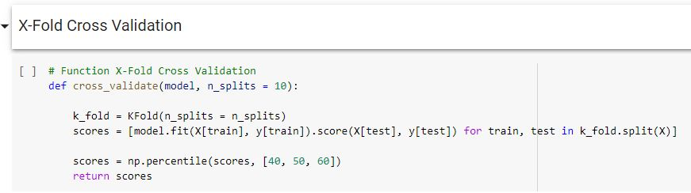

## K Nearest Neighbours
**KNN Model was discovered the K = 9 gave the best results:
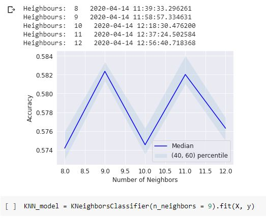

## Decision Three
**A tree depth of 15 gave the best model performance:**
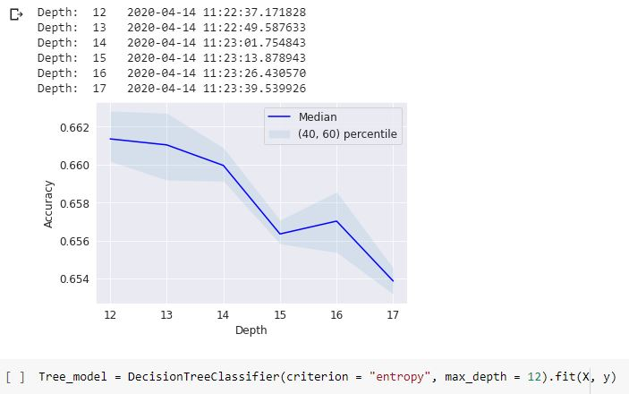

## Logistic Regression
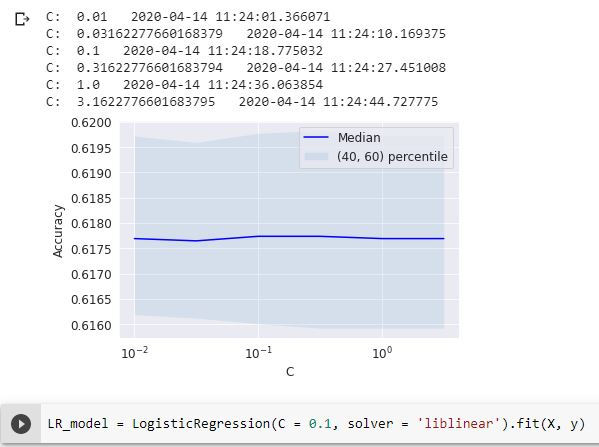

## Naive Bayes
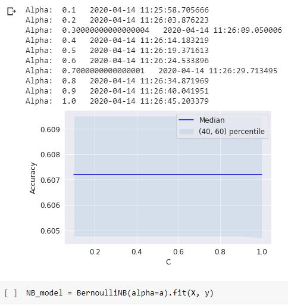

## Decision Forest using a Random Forest

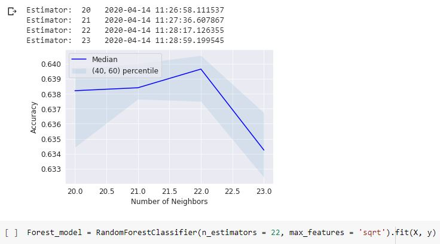

## Best model

## Predict the Final Performance of the Model

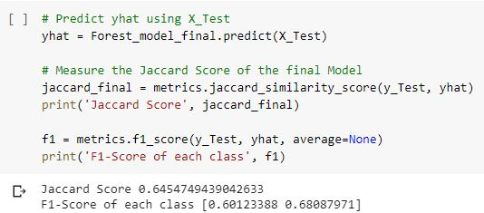

## Important features

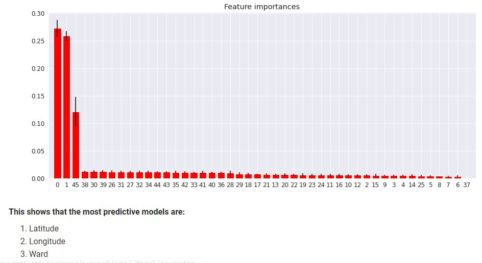

# 4 - Results

It was not possible to predict where and when crimes will happen, however, a binary combination was made where 0 to represent without crime and 1 to represent potentially that a crime will happen.

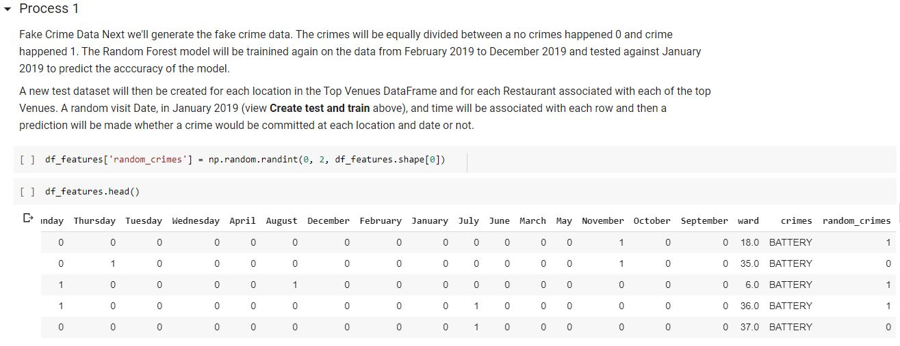

## Test Data
The test data was contructed from the the Top Venues Data Frame (nightclubs):

Next a random date and time was assigned to each venue.
The date was then split into Hour, Day of Week, Month and Year as described above
The data was finally prepared for prediction by applying One Hot encoding and then extracted into a new dataframe that match the format used to create the model.
y^ (y_hat) or the predictions were then made

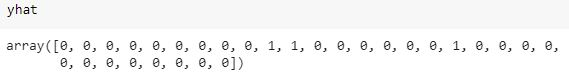

**Important** - Due to the fact that the top venues (30 night clubs) do not have crimes at all hours or every month, the dataframe created did not have its complete picture, with some columns missing, however, the model was created on top of all data, which have all columns, when generating the forecast, an error occurred in which the model did not have the same number of columns as the top venues data.
For this reason, some columns were created manually with values 0 and included manually.
See the difference on the notebook.

It is observed that 3 sites out of 30 have 1 in the "prediction" column.

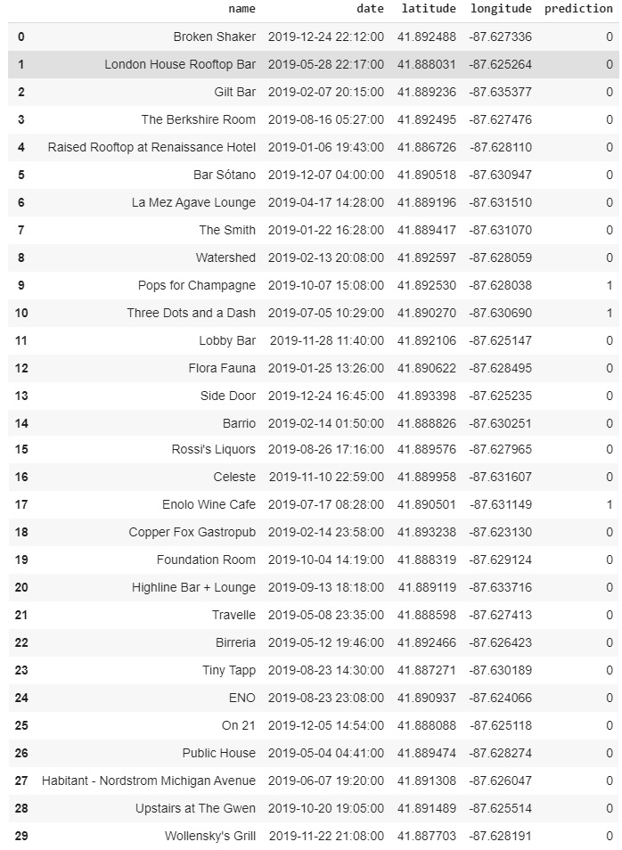

## Visualisation of Predictions

1 - Enolo Wine Cafe | 2 - Three Dots and Dash | 3 - Pops for Champagne

### Total visualization

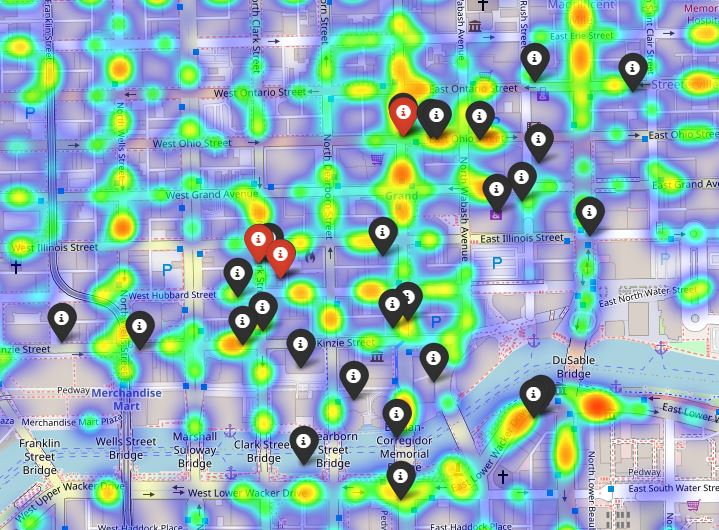

## 1 - Enolo Wine Cafe | 2 - Three Dots and Dash

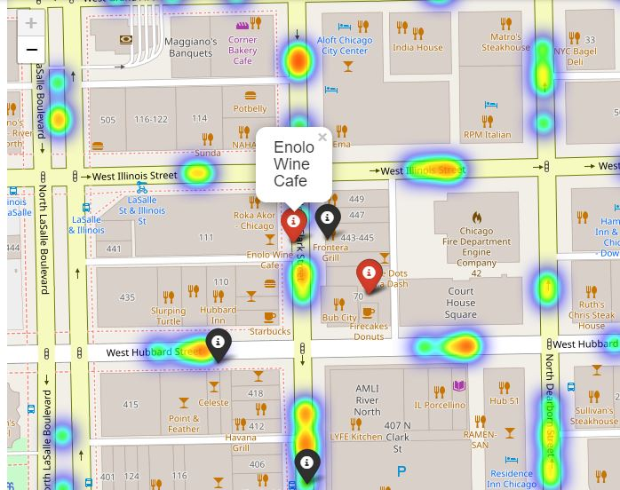

## 3 - Pops for Champagne

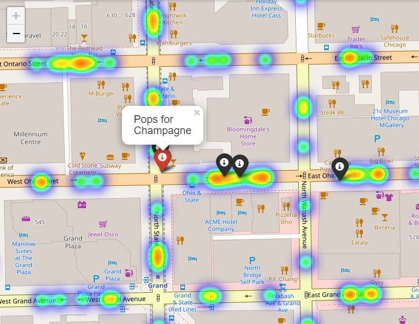

# Conclusion

First of all, I have to mention the growth of my skills after all the courses of the IBM Data Science Professional Certificate, all the challenges proposed were of great value for the accomplishment of this project.

The objectives were achieved despite some problems midway through.
The basic plan of the Foursquare API for Developers has a very short limit of consultations per day and until I get used to it, I exceeded that limit several times, making me have to wait for the next day and later having to pass the data to my personal drive and introducing it again.

# Discussion

Chicago is to be congratulated for providing open data with this quality and with an extremely interactive and simple platform, even having an area for developers.

Today (2020), we are experiencing the Coronavirus pandemic and I have observed many platforms developed for this cause, with humanitarian aid from data scientists to carry out projects on top of the data.

With the example of Chicago and the available data on Cornonavirus ... Shouldn't they look more at the importance of data and its availability?
