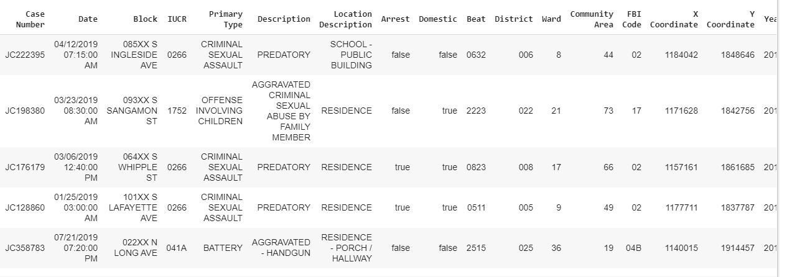
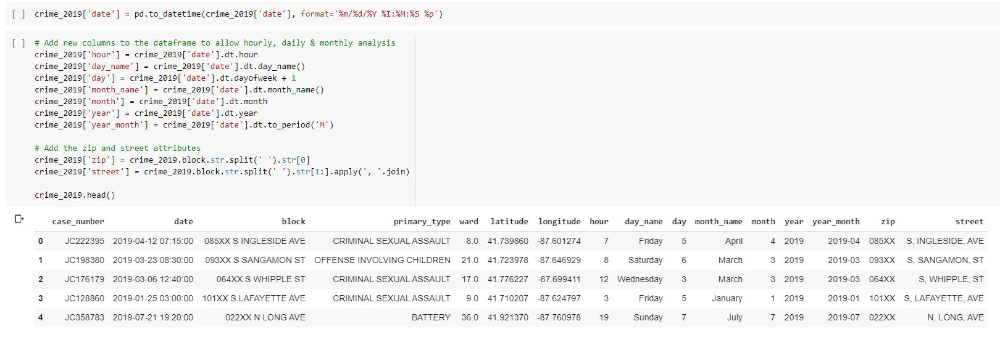
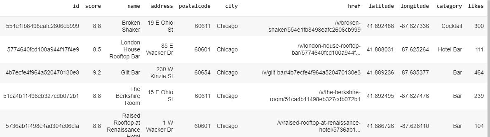

# Coursera_Capstone
Final course of IBM Data Science Professional Certificate by Coursera.

Requisites:
1- Introduction | 2- Data | 3- Methodology | 4 - Results | 5 - Discussion | 6- Conclusion
# 1 - Introduction 
Many world metropolises have overpopulation and high purchasing power in common. This mixture of ingredients often leads to high crime rates.
Since tourists do not have an in-depth knowledge of common crime points, this project was inspired by the protection of these tourists.

## Real world case

In general, every traveler, whether for business or pleasure, intends to enjoy a little of the place and have fun.
Inspired by a scenario in which some co-workers will go to Chicago on business, they will have a few more days to explore the city. Knowing them, I know they like to go out at night after work and drink some drikes and listen to good music.

This project's main idea is to predict the potential for a crime to happen close to a nightclub search on foursquare.

Let's go!

# 2 - Data
In this session I will quickly explain the origin and method of data acquisition.

## Crimes occurred in Chicago in 2019 
The data were accessed at: https://data.cityofchicago.org/Public-Safety/Crimes-2019/w98m-zvie, where the API was generated to download in https://data.cityofchicago.org/api/views/w98m-zvie/rows.csv?accessType=DOWNLOAD&api_foundry=true.

After some procedures for cleaning the data and creating new columns (which can be seen in detail in the attached notebook, remember, we are in the "Readme"), a new dataframe was created for the crimes that occurred in 2019.

### Descriptive statistics of Chicago crimes

## Nightclubs
With a focus on a particular region where there are many blogs talking about nightlife, the data was taken by the link below, where it was focused on a particular region and nightlife.
https://foursquare.com/explore?mode=url&ne=41.893525%2C-87.622678&q=Nightlife&sw=41.886624%2C-87.635788.
The data was retrieved by a foursquare API where my credentials were introduced and the link above, where it was converted to HTML where I took the most important "classes".
You can see more details in the attached notebook.

