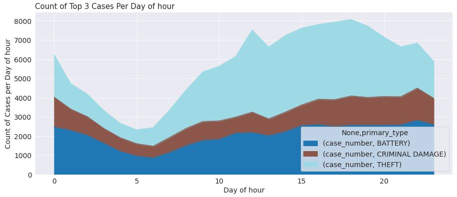

# Coursera_Capstone
Final course of IBM Data Science Professional Certificate by Coursera.

Requisites:
1- Introduction | 2- Data | 3- Methodology | 4 - Results | 5 - Discussion | 6- Conclusion
# 1 - Introduction 
Many world metropolises have overpopulation and high purchasing power in common. This mixture of ingredients often leads to high crime rates.
Since tourists do not have an in-depth knowledge of common crime points, this project was inspired by the protection of these tourists.

## Real world case

In general, every traveler, whether for business or pleasure, intends to enjoy a little of the place and have fun.
Inspired by a scenario in which some co-workers will go to Chicago on business, they will have a few more days to explore the city. Knowing them, I know they like to go out at night after work and drink some drikes and listen to good music.

This project's main idea is to predict the potential for a crime to happen close to a nightclub search on foursquare.

Let's go!

# 2 - Data
In this session I will quickly explain the origin and method of data acquisition.

## Crimes occurred in Chicago in 2019 
The data were accessed at: https://data.cityofchicago.org/Public-Safety/Crimes-2019/w98m-zvie, where the API was generated to download in https://data.cityofchicago.org/api/views/w98m-zvie/rows.csv?accessType=DOWNLOAD&api_foundry=true.

After some procedures for cleaning the data and creating new columns (which can be seen in detail in the attached notebook, remember, we are in the "Readme"), a new dataframe was created for the crimes that occurred in 2019.

## Descriptive statistics of Chicago crimes
## Graphs

## Maps 
### Distribution of the 3 most common types of crimes in Chicago in july or reasons of ease of processing data.

### The same data in cluster view

### Heat map

## Nightclubs
With a focus on a particular region where there are many blogs talking about nightlife, the data was taken by the link below, where it was focused on a particular region and nightlife.
https://foursquare.com/explore?mode=url&ne=41.893525%2C-87.622678&q=Nightlife&sw=41.886624%2C-87.635788.
The data was retrieved by a foursquare API where my credentials were introduced and the link above, where it was converted to HTML where I took the most important "classes".
You can see more details in the attached notebook.

## Maps 

### Initially the top 3 nightclubs were selected based on the likes received on foursquare, however, later those 3 were insufficient, with that, I used the top 30 nightclubs.

On the map you can see the 3 initials in red and the rest in black.

### Heat map of crimes and nightclubs

# 3 - Methodology

## Modeling

### Transform dataframa in only numerical and remove descriptive columns
See more details on notebook

## Models
**Modelling task was turned into a simple binary classification task by only modelling based on the top two most occuring crimes. For each model development 10 Fold Cross Validation was used to ensure the best results were achieved and a Grid Search approach was used to determine the best setting for each of the models** 

### Cross validation

## K Nearest Neighbours
**KNN Model was discovered the K = 9 gave the best results:

## Decision Three
**A tree depth of 15 gave the best model performance:**

## Logistic Regression

## Naive Bayes

## Decision Forest using a Random Forest

## Best model

